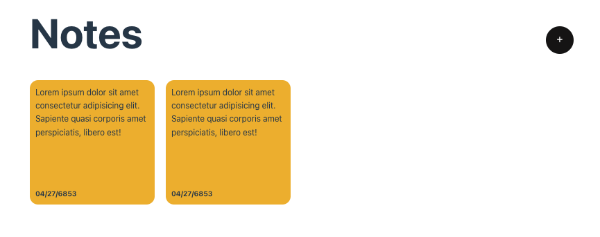

# notes-app

## Project Overview

To learn more about Vue 3 by creating a note app project. 

This is based from Udemy by Laith Harb. 

## Project Setup

```sh
npm install
```

### Compile and Hot-Reload for Development

```sh
npm run dev
```

### Type-Check, Compile and Minify for Production

```sh
npm run build
```

### Lint with [ESLint](https://eslint.org/)

```sh
npm run lint
```
___

## Screenshots

Initial Cards created. Currently no logic. This is the basic HTML structure. 



## Notes

* Create the basic HTML structure
* Functionality for the + button to display the modal 


